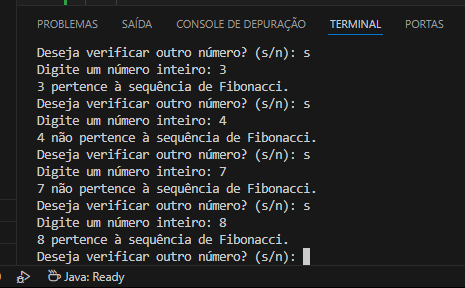
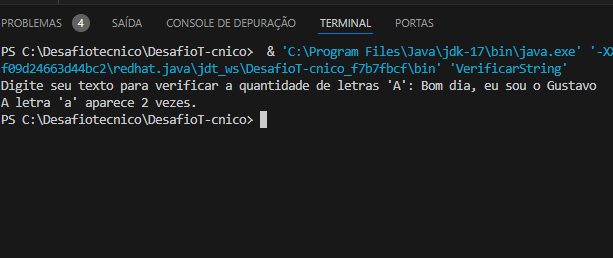
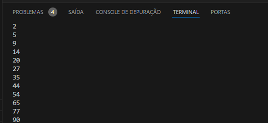

# DesafioTécnico

## Técnica:

## 1) Dado a sequência de Fibonacci, onde se inicia por 0 e 1 e o próximo valor sempre será a soma dos 2 valores anteriores (exemplo: 0, 1, 1, 2, 3, 5, 8, 13, 21, 34...), escreva um programa na linguagem que desejar onde, informado um número, ele calcule a sequência de Fibonacci e retorne uma mensagem avisando se o número informado pertence ou não a sequência.

IMPORTANTE: Esse número pode ser informado através de qualquer entrada de sua preferência ou pode ser previamente definido no código;

## Resultado:

`Foi adicionado um loop para não encerrar o programa e conferir mais rápido.`

## 2) Escreva um programa que verifique, em uma string, a existência da letra ‘a’, seja maiúscula ou minúscula, além de informar a quantidade de vezes em que ela ocorre.

IMPORTANTE: Essa string pode ser informada através de qualquer entrada de sua preferência ou pode ser previamente definida no código;

## Resultado:

## 3) Observe o trecho de código abaixo: int INDICE = 12, SOMA = 0, K = 1; enquanto K < INDICE faça { K = K + 1; SOMA = SOMA + K; } imprimir(SOMA);

Ao final do processamento, qual será o valor da variável SOMA?

## Resposta: `90`

## 4) Descubra a lógica e complete o próximo elemento:
a) 1, 3, 5, 7, `9`

b) 2, 4, 8, 16, 32, 64, `128`

c) 0, 1, 4, 9, 16, 25, 36, `49`

d) 4, 16, 36, 64, `100`

e) 1, 1, 2, 3, 5, 8, `13`

f) 2,10, 12, 16, 17, 18, 19, `20`

## 5) Você está em uma sala com três interruptores, cada um conectado a uma lâmpada em salas diferentes. Você não pode ver as lâmpadas da sala em que está, mas pode ligar e desligar os interruptores quantas vezes quiser. Seu objetivo é descobrir qual interruptor controla qual lâmpada. Como você faria para descobrir, usando apenas duas idas até uma das salas das lâmpadas, qual interruptor controla cada lâmpada?  

## Resposta: 
`Ligue o primeiro interruptor e deixe-o ligado por alguns minutos até esquentar a lâmpada. Desligue o primeiro interruptor e ligue o segundo interruptor, deixando-o ligado. Agora vá até as salas. A lâmpada que estiver acesa é do segundo interruptor. A lâmpada que estiver desligada e quente é do primeiro interruptor. A última lâmpada será a do terceiro interruptor.`